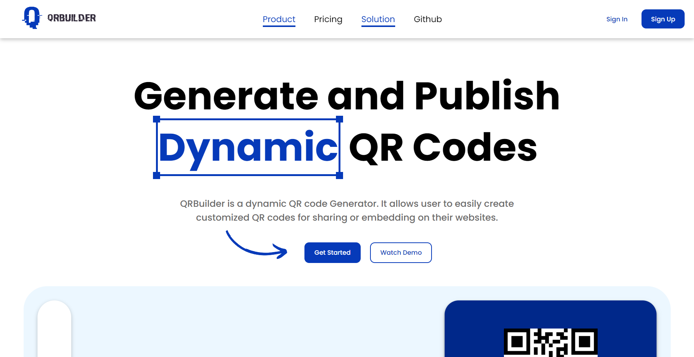
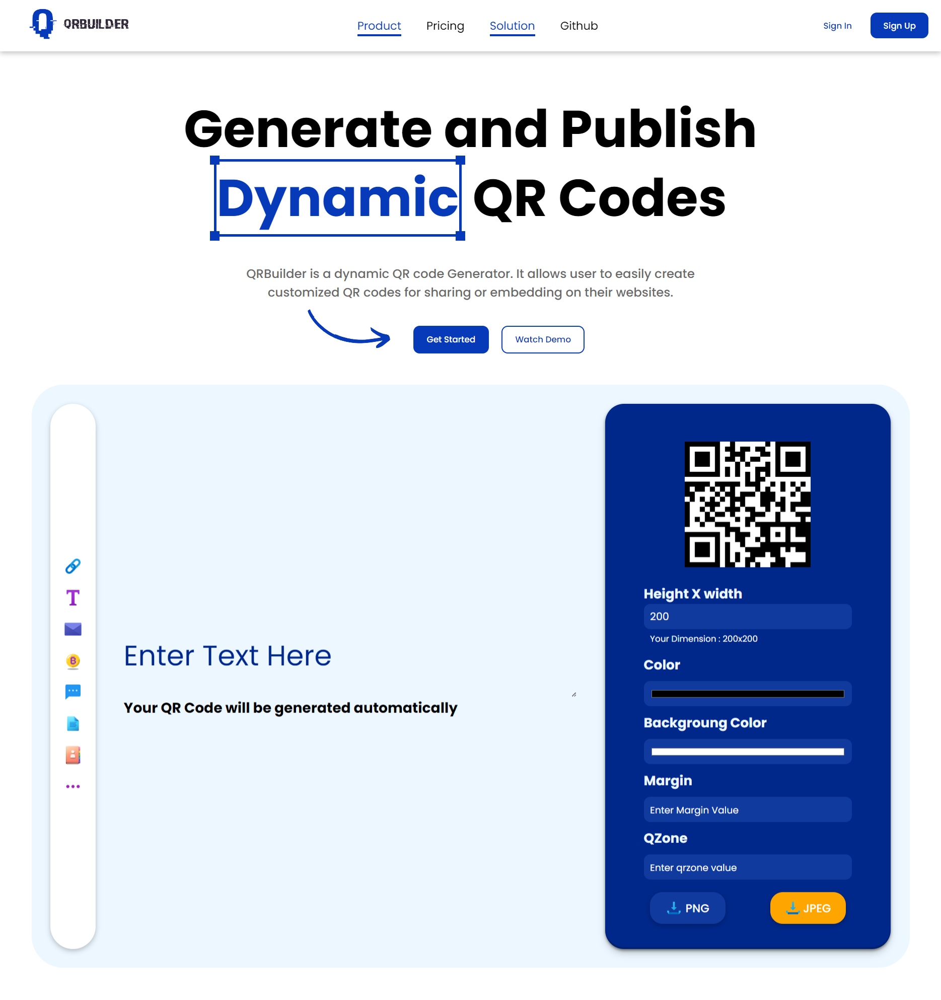
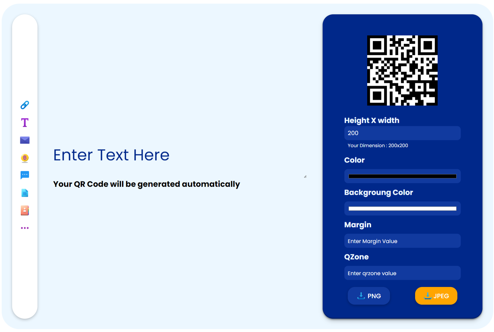
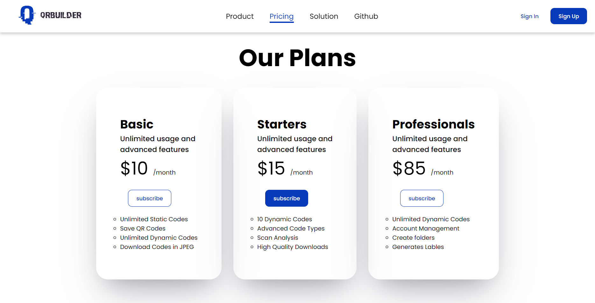

<h3 align="center">
  <br/>
  " QRBuilder is a dynamic QR code Generator.! "<br/>
  <a href="https://qrbuilder.vercel.app" target=""_blank> 1. https://qrbuilder.vercel.app</a><br />
</h3>


<div align="center">

</div>

<div align="center">
&nbsp;&nbsp;<br>&nbsp;&nbsp;&nbsp;</p>
</div>

### Repo Status ✳️


<div align="center">
 
	
	
	
 	 
<br>
	
	
	
	
</div>
<div align="center">
 <p> 


 </p>
 </div>

### Description 🌵


#### QRBuilder-QRBuilder is a dynamic QR code Generator.!

QRBuilder is a dynamic QR code Generator. It allows user to easily create
customized QR codes for sharing or embedding on their websites.
QRBuilder is an innovative and user-friendly dynamic QR code generator that empowers users to effortlessly create personalized QR codes tailored to their specific needs. Whether it's for sharing contact information, website URLs, product details, or any other data, QRBuilder provides a seamless platform for designing and customizing QR codes that resonate with individual branding and preferences. With its intuitive interface, users can quickly generate QR codes and even embed them on their websites, enabling seamless information exchange and enhanced user engagement. Simplifying the process of QR code creation, QRBuilder is the go-to tool for anyone seeking a versatile and efficient solution for sharing data in an interactive and visually appealing manner.

### Features 😱


- Customization Options
- Dynamic QR Codes
- Multiple Data Types
- Website Embedding
- Secure and Reliable
- Cross platform

### Steps For Contribution⚡


0. Star ⭐
1. Fork
2. Clone the forked repository.

```css
git clone https://github.com/<your-github-username>/QR-Code-Generator

```

3. Navigate to the project directory.

```py
cd QR-Code-Generator

```

4. Create a new branch.

```css
git checkout -b <your_branch_name>

```

5. Make changes.
6. Stage your changes and commit

```css
git add -A

git commit -m "<your_commit_message>"

```

7. Push your local commits to the remote repo.

```css
git push -u origin <your_branch_name>

```

8. Create a Pull Request.
9. Congratulations! 🎉 you've made your contribution.

### Screenshots 📷


##### HomePage



##### Full HomePage



##### QR Section



##### Pricing Page



### Social Links 🔗


<p align="center"><a href="https://www.instagram.com/bishal_de/" target='_blank'></a>&nbsp;
<a href="https://www.linkedin.com/in/bishalde/" target='_blank'></a>&nbsp;
<a href="https://github.com/bishalde/" target='_blank'></a>&nbsp;
<a href="@itsbishalde" target='_blank'></a>&nbsp;<br/>
<a href="https://wa.me/+918299260163?text=Hello!" target='_blank'></a>&nbsp;
<a href="https://www.hackerrank.com/bishalde" target='_blank'></a>&nbsp;
<a href="https://www.codechef.com/users/bishalde" target='_blank'></a>&nbsp;</p>

### Give Me A Bow 🏹


<a href="https://www.buymeacoffee.com/bishalde" target='_blank'></a>&nbsp;<a href="https://ko-fi.com/bishalde" target='_blank'></a>

### Our Contributors ✨


Thank you to all the amazing contributors who have made this project possible!!💝